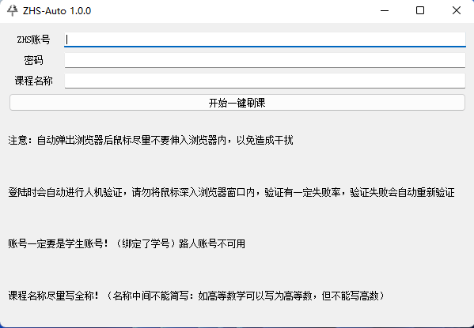

# 智慧树自动化刷课脚本 🚀
2022最新自动跳人机交互检测的新版刷课工具

## :warning:注意 ：一定要使用**chrome浏览器**，其他浏览器暂不支持!!!
chrome官网地址: https://www.google.cn/chrome/index.html

## 实现功能(v1.0.0)
- [x] 基于ai跳过人机验证，无须手动登录
- [x] 16x速度，直接起飞 ✈️
- [ ] 后台刷课
- [ ] 记录账号密码
- [x] 不会被检测到脚本异常

## 使用：

下载release的版本使用即可，

使用注意事项：

* 智慧树账号一定要是学生账号（即绑定了学校的账号）
* 课程名称尽量写全称！！ 中间部分不可简写，比如：“高等数学”可以写成“高等”，但注意部分课程重名问题，尽量写全
* 点击开始按钮需要耐心等待一段时间（请勿多次重复点击）；开始后的cmd窗口请勿关闭；
* 进行登录人机验证会有一定出错几率，失败会自动刷新，请耐心等待，且勿将鼠标深入浏览器窗口内

> 可刷课范围：

我的学堂：共享学分课->共享课 一般学生需要看的网课都在这里面

> 提醒：

请勿盲目刷课，注意是否有学习习惯分（比如每天需要看25分钟记一次习惯分，看多了不计分且重复看不计分），有学习习惯分的刷多了就寄，请注意！！！！！！
